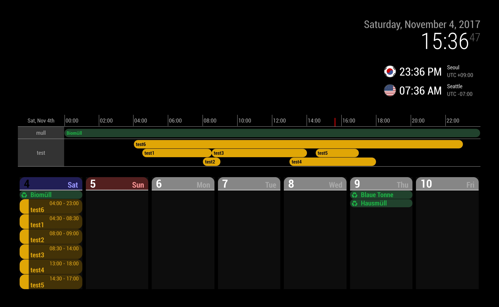

# MMM-CalendarExtTimeline

Display current timeline schedules. This module works with the built-in `calendar` module or [MMM-CalendarExt2](https://github.com/MagicMirrorModules/MMM-CalendarExt2).

## Screenshot



## Installation

**If you use `MMM-CalendarExt2`, install it together with this module.**

**If you use the built-in `calendar` module, enable `broadcastEvents: true` in that module.**

```shell
cd ~/MagicMirror/modules
git clone https://github.com/MagicMirrorModules/MMM-CalendarExtTimeline
```

## Configuration

```javascript
{
  module: "MMM-CalendarExtTimeline",
  position: "bottom_bar",
  config: {
    type: "static", // "static", "dynamic"
    refresh_interval_sec: 60, // minimum 60
    table_title_format: "ddd, MMM Do",
    begin_hour: 0, // ignored when type is "dynamic"
    end_hour: 6, // how many hours to show
    fromNow: 0, // add this many days to today's current date, e.g., 1 is tomorrow, -1 is yesterday
    time_display_section_count: 6,
    calendars: ["your calendar name", "another name"], // calendar.name values or CalendarExt2 names
    source: "CALENDAR" // or "CALEXT2"
  }
},
```
Time labels follow MagicMirror's global `timeFormat` setting (12/24h).
For the built-in `calendar` module, make sure the calendar entry has a `name` and `broadcastEvents: true`, for example:

```javascript
{
  module: "calendar",
  config: {
    calendars: [
      {
        name: "Demo Calendar",
        url: "http://localhost:8080/modules/MMM-CalendarExtTimeline/demo.ics"
      }
    ],
    broadcastEvents: true
  }
},
```
### type:"static" or "dynamic"

#### type:"static"

This will show timeline from `begin_hour` to `end_hour` of today.

Example:
```javascript
config: {
  type: "static",
  begin_hour: 6,
  end_hour: 18
}
```
This shows the timeline for today from 06:00 to 18:00.

#### type:"dynamic"

This will show timeline from `this hour` during `end_hour` now.
```javascript
config: {
  type: "dynamic",
  end_hour: 6
}
```
If the current time is 13:45, this shows schedules from 13:00 to 19:00. The view updates automatically as time passes.
`begin_hour` will be ignored when type is set to `dynamic`.

### transform

See [Transforming in MMM-CalendarExt2](https://github.com/MagicMirrorModules/MMM-CalendarExt2/blob/master/docs/Filtering-and-Sorting.md#transforming). A `transform` key can be added to the MMM-CalendarExtTimeline config when using `MMM-CalendarExt2`, for example:

```javascript
transform: (event) => {
  if (event.title.includes("Meeting")) {
    event.styleName = "meeting-style" // Change the CSS class name to highlight meetings
  }
  return event
},
```
